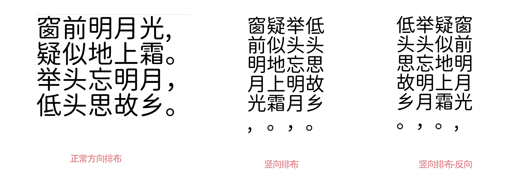

# text-to-svg-plus

Based on the shrhdk's [text-to-svg](https://github.com/shrhdk/text-to-svg) library, the actual production Chinese text to picture svg library written。

## preview



## usage

```js
const textToSvgPlus = require("text-to-svg-plus");

const options = {
  text: "窗前明月光，疑似地上霜。举头望明月，低头思故乡。",
  fontSize: 30,
  width: 500,
  height: 500,
  direction: "ttb",
  letterSpacing: 1,
  color: "#000000",
  textAlign: "center",
  fontWeight: "bold",
  opacity: 0.2,
  fontFamily: "",
  borderWidth: 2,
  borderColor: "#ff5500",
  borderRadius: 10,
  lineHeight: 2,
  background: "#eee",
  verticalAlign: "middle",
  wordWrap: "auto",
};

new Svg(options).toFile(path.join(__dirname, "dist"));
```

## methods

- toFile()
- toBuffer()

## options

- fontSize: 字体大小
- lineHeight: 行高
- letterSpacing: 文字间距
- width: 图片宽
- height: 图片高
- direction: 文字方向
  - ltr 从左到右
  - ttb 从上到下
  - ttb_rtl 从上到下，从右到左
- color: 字体颜色
- textAlign: 'left',
  - left
  - center
- verticalAlign `<String>`
  - top
  - middle
- fontFamily: 字体
- wordWrap:
  - nowrap 自动缩放
  - auto 根据 width height 来换行
